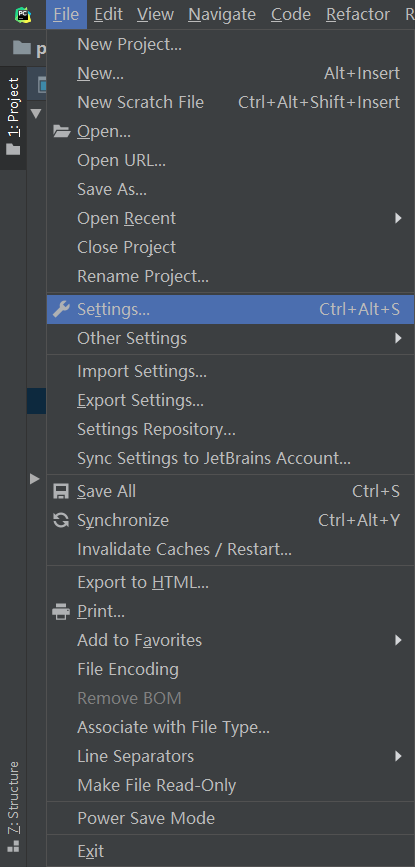
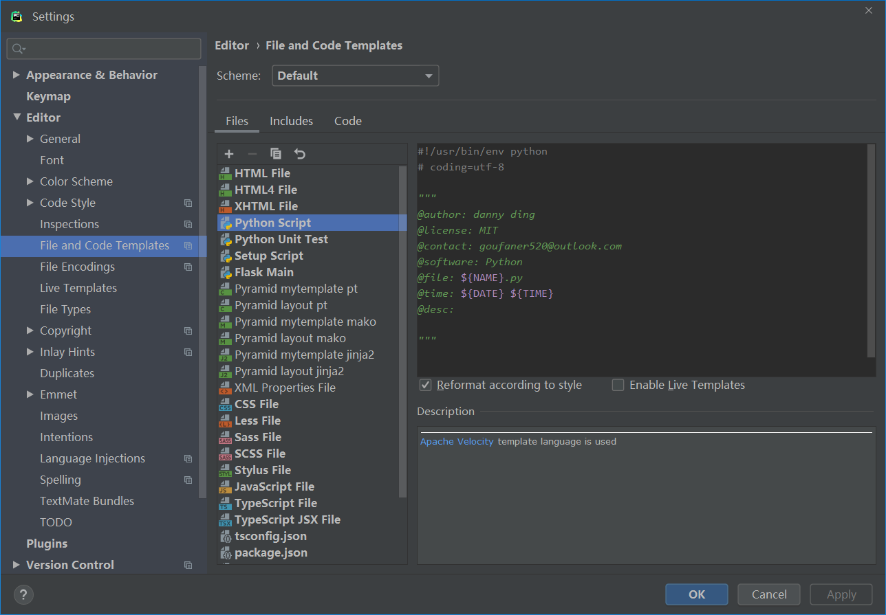
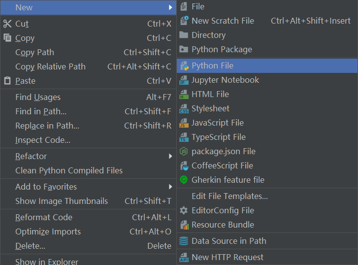
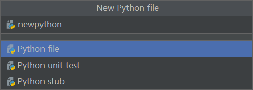
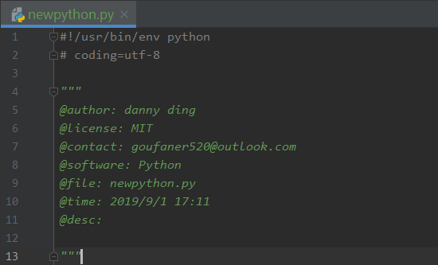

## Pycharm在创建py文件时,自动添加文件头注释

1.选择File -> Settings



2.选择 File and Code Templates -> Files -> Python Script

编辑代码的样式

```
#!/usr/bin/env python
# coding=utf-8

"""
@author: danny ding
@license: MIT
@contact: goufaner520@outlook.com
@software: Python
@file: ${NAME}.py
@time: ${DATE} ${TIME}
@desc: 

"""
```


3.新建一个python



输入文件名，选择Python file



文件如下所示:




