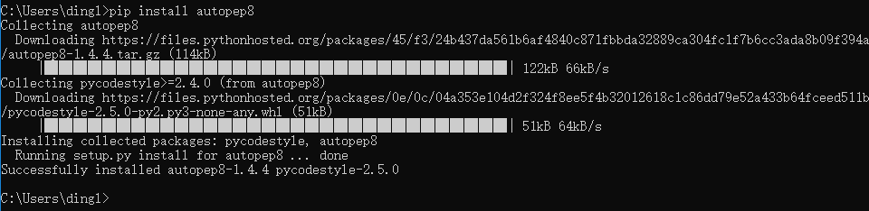
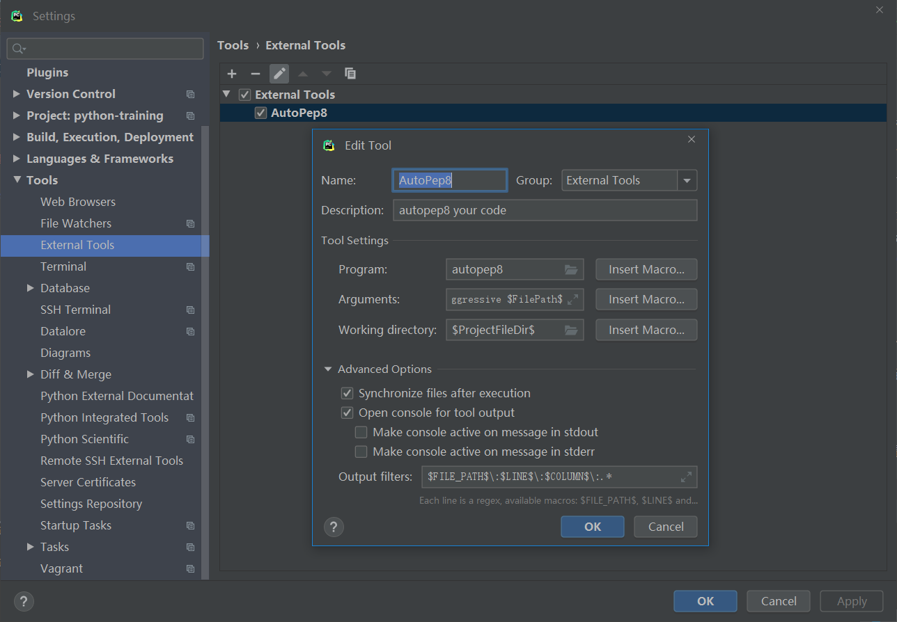
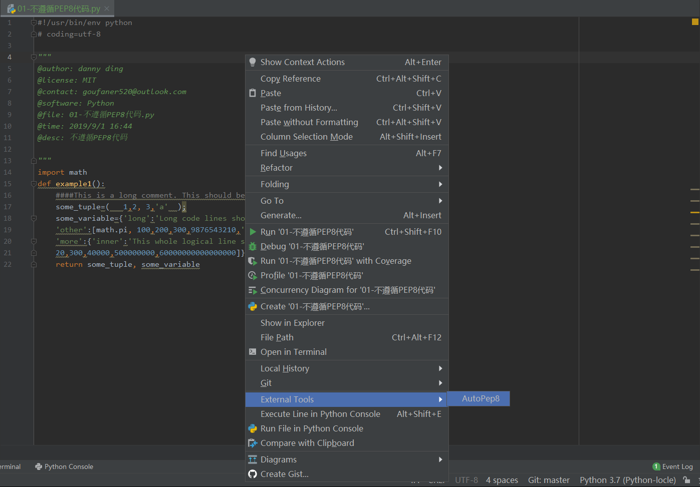

# 在Pycharm中配置autopep8

### 关于PEP 8

[PEP 8](https://www.python.org/dev/peps/pep-0008/)，Style Guide for Python Code，是Python官方推出的Python编码风格的约定，虽然这不是硬性的规定，但是如果Python程序员都尽量遵循这个文档，那么编码风格的统一会让代码的可读性大大提升。

在Pycharm里边默认也是有进行PEP8的检测，强迫症的人表示，看到代码中有黄色波浪线，就一定得先改好它。

### 关于autopep8

官网的描述是：
```
autopep8 automatically formats Python code to conform to the PEP 8 style guide. 
It uses the pep8 utility to determine what parts of the code needs to be formatted. 
autopep8 is capable of fixing most of the formatting issues that can be reported by pep8.
```

通过它，可以修复大部分PEP8工具中报告的代码排版问题。举个官网的例子：

```python
def example1():
    ####This is a long comment. This should be wrapped to fit within 72 characters.
    some_tuple=(   1,2, 3,'a'  );
    some_variable={'long':'Long code lines should be wrapped within 79 characters.',
    'other':[math.pi, 100,200,300,9876543210,'This is a long string that goes on'],
    'more':{'inner':'This whole logical line should be wrapped.',some_tuple:[1,
    20,300,40000,500000000,60000000000000000]}}
    return some_tuple, some_variable
```

这是一个比较极端情况的例子，在使用了autopep8自动修复后：

```python
def example1():
    # This is a long comment. This should be wrapped to fit within 72
    # characters.
    some_tuple = (1, 2, 3, 'a')
    some_variable = {
        'long': 'Long code lines should be wrapped within 79 characters.',
        'other': [
            math.pi,
            100,
            200,
            300,
            9876543210,
            'This is a long string that goes on'],
        'more': {
            'inner': 'This whole logical line should be wrapped.',
            some_tuple: [
                1,
                20,
                300,
                40000,
                500000000,
                60000000000000000]}}
    return some_tuple, some_variable
```

是不是看起来焕然一新了？

### Pycharm中使用autopep8作为扩展工具

#### 安装autopep8

```python
pip install autopep8
```


#### Pycharm进行设置

+ Settings–>Tools–>External Tools 点击添加按钮
    - Name：AutoPep8（可以自定义）
    - Tools settings:
    - Programs：autopep8（不能修改）
    - Parameters：--in-place --aggressive --aggressive $FilePath$
    - Working directory：$ProjectFileDir$
+ 点击Output Files
    - 点击添加，名称可以任意填写
    - Regular expression to match output：$FILE_PATH$\:$LINE$\:$COLUMN$\:.*



#### 实际使用
在右击上代码–>External Tool–>autopep8

Pycharm自动调用了autopep8对当前文件进行PEP8优化。



#### autopep8的一些设置点

在上边说到，在Parameters的设置是:--in-place --aggressive --aggressive $FilePath$

–in-place 代表会直接修改源文件

–aggressive autopep8默认只修复空白，对齐相关的PEP8问题，加入--aggressive设置，会增加修复如 x == None 修复为 x is None，{“a”: 1, “b”: 2}.has_key(‘a’) 修复为’a’ in {“a”: 1, “b”: 2}

–ignore 忽略PEP8检查项

因为我只打算用autopep8来修复空格，空行这一类的排版问题，同时要忽略每一行长度过长的检测（E501 - Try to make lines fit within –max-line-length characters.），所以最终设置是：

--in-place --ignore=E501 $FilePath$